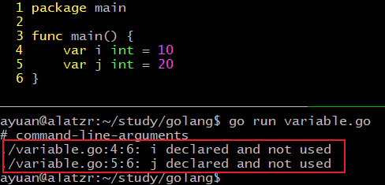
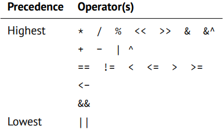

# Golang 学习笔记

## 一、hello world

```go
package main
import "fmt"  // 写作 ."fmt" 则可直接调用库数，如Println

func mian(){
    fmt.Println("HELLO WORLD")  
}
```

编译：`go build helloworld.go`

直接运行：`go run helloworld.go`

### 1.1输入和输出

[fmt package in Doc](https://pkg.go.dev/fmt#pkg-functions)

```go
package main
import "fmt"

func main(){
    /*
    输入和输出：
    	fmt包；输入输出
    	输出：
    		Print() 打印
    		Println() 换行打印
    		Printf() 格式化打印
    	输入：
    		Scanf() 格式化输入
    		Scanln() 输入
    		bufio.NewReader(os.Stdin)	
    */
    i := 'w'
    fmt.Printf("%%q：%q\n", i)  // 'w'     原字符
    fmt.Printf("%%v: %v\n", i)  // 119     the value in a default format
    fmt.Printf("%%#v: %#v\n", i)  // 119   value
    fmt.Printf("%%T：%T\n", i)  // int32   type
    fmt.Printf("%%U：%U\n", i)  // U+0077  Unicode Format
    fmt.Printf("%%p：%p\n", i)  // 内存地址
    var (
    	x int
        y string
        j float64
        k int
    )
    fmt.Print("请输入一个整数，一个字符串：")
    fmt.Scanln(&x, &y)  // 读取键盘输入，通过操作地址赋值给x，y
    fmt.Prinln(x, y)
    
    fmt.Println("请输入一个浮点数，一个整数，用三个英文逗号隔开：")
    fmt.Scanf("%f,,,%d", &j, &k)
    fmt.Prinln(j, k)
    
    fmt.Print("请输入一个字符串：")
    reader = bufio.Reader(os.Stdin)
    s1, _ = reader.ReadString('\n')  // 遇到\n结束输入
    fmt.Println(s1)
}
```

out:

> %q：'w'
> %v: 119
> %#v: 119
> %T：int32
> %U：U+0077
> %p：%!p(int32=119)
> 请输入一个整数，一个字符串：10 abc
> 10 abc
> 请输入一个浮点数，一个整数，用三个英文逗号隔开：
> 3.14,,,222
> 3.14 222
> 请输入一个字符串：like
> like


**the default format for %v is:**

> ```
> bool:                    %t
> int, int8 etc.:          %d
> uint, uint8 etc.:        %d, %#x if printed with %#v
> float32, complex64, etc: %g
> string:                  %s
> chan:                    %p
> pointer:                 %p
> ```

## 二、变量

### 2.1变量声明：

```go
var a int  // 声明int类型变量a，默认赋值为null
var s string  // 声明string类型变量s，默认值为""
var b bool  // 声明布尔类型变量b，默认值为false

/*多个声明为组*/
var (
	x int = 10
    y bool
    z string
)
/* 多变量声明和赋值 */
var a, b, c, d = v1, v2, v3, v4 // v1~v4可以为不同类型


/* 简短声明赋值方法 */
var sex = "male"  // 变量有初值，go可以自动推断类型
name := "gdy"   // 此种方式不能作为全局变量的声明，只能用在函数体内
age := 25


/*字符串和字符*/
var str string = "这是一个字符串"  // 字符串不可变，同python
var multi_str string =`first line  // 多行字符串使用反撇号``包裹
second line
third line
`
var chr rune = 'a'  // rune是int32的别名，utf-8编码，a的值为对应的ASCII码，97
```

**注意事项：**

1. 变量必须先定义后使用
2. 变量类型和赋值类型必须一致
3. 变量名不能冲突（同一个作用域内）
4. 简短定义方式不能定义全局变量，且定义的变量必须是新变量
5. 变量定义后必须使用

变量在声明后未使用会报错：

<br/>

### 2.2常量

常量的声明使用const关键字，常量只能是数字，字符串或者布尔值。

`const <name> type = value`

```go
const a string = "abc"  // 显式定义
const b = 10  // 隐式定义
```

枚举类型常量：

```go
// iota可以生成枚举值
const (
	a = 10
    b 		  // b = 10
    c = iota  // c = 2
    d		  // d = 3
    e = 10 
    f         // f = 10
    g = iota  // g = 6  
)
```

>单词 [iota] 在日常英语短语 “not one iota”，意思是 “不是最小”，是来自新约中的短语：“until heaven and earth pass away, not an iota, not a dot, will pass from the Law.”


### 2.3运算符、关键字

运算符：

<br/>

```go
/*
位运算符：
	将数值转换为二进制后进行运算，按位操作
	与：&
	或：|
	异或：^
		二元：a ^ b
			相同为1，不同为0
		一元：^a  
			按位取反：
			1——>0
			0——>1
	位清空：&^
		对于 a &^ b, 如果b上数值为1，则结果位去0，如果b上数值为0，则取a的值。
*/
```


关键字：

<br/>


## 三、数据类型

### 3.1基本数据类型

- bool 布尔类型
- Numeric Types 整型
  - int8，int16，int32，int64
  - uint8，uint16，uint32，uint64
  - float32，float64
  - complex64，complex128
  - byte
  - rune
- string 字符型

```go
/*
go语言的基本数据类型：
    1.基本数据类型：
        布尔类型:
            取值：true， false
        数值类型：
            整数int：
                有符号：最高位表示符号位，0整1负，其余为表示数值
                    int8：-128~127
                    int16：-32768~32767
                    int32：-2147483648~2147483647
                    int64：-9223372036854775808~9223372036854775807 （19位数）
                无符号：所有位都表示数值
                    uint8：0~256
                    uint16：0~65535
                    uint32：0~4294967295  （10位数）
                    uint64：0~18446744073709551615 （20位数）
                另外：
                    byte：unit8的别称
                    rune：int32的别称
            浮点数float：
                单精度float32:
                双精度float64:
            负数complex：
        字符串
    2.复合类型
        array, slice, map, fucntion, pointer, struct, interface, channel...
*/
```


### 3.2数据类型转换

语法格式：`Type(value)`

```go
/*兼容类型可以转换，如int和float之间。不兼容类型要使用其他方法，如int和string*/
var a int = 10
var b float32
b = float32(a)  // 不支持隐式转换，写作b = a会报错
```


## 四、流程控制语句

### 4.1条件语句if

语法格式：

```go
if 布尔表达式{
    /*布尔表达式为true时执行*/
}
```

```go
if 布尔表达式 {
   /* 在布尔表达式为 true 时执行 */
} else {
  /* 在布尔表达式为 false 时执行 */
}
```

```go
if 布尔表达式1 {
   /* 在布尔表达式1为 true 时执行 */
} else if 布尔表达式2{
   /* 在布尔表达式1为 false ,布尔表达式2为true时执行 */
} else{
   /* 在上面两个布尔表达式都为false时，执行*/
}
```

输出a和b中较大的值：

```go
package main
import ."fmt"

func main(){
    var a int = 10
    b := 20
    if a > b{
        Println(a)
    } else{
        Println(n)
    }
}
```

变体：

```go
package main
import ."fmt"

func main(){
    if num := 20; num > 10 && num % 2 == 0{  // 此时num的作用域只在if内
        Println(num)
    }
}
```


### 4.2条件语句switch

语法格式：

```go
switch var1 {
    case val1:
        ...
    case val2:
        ...
    default:
        ...
}
```

```go
package main
import ."fmt"

func main(){
    var grade string
    var mark = 90
    // mark的值进行匹配
    switch mark{
        case 90: grade = "A"
        case 80: grade = "B"
        case 60,70: grade = "C"  // 可以多个值
        default: grade = "D"
    }
    // switch 后面没有表达式，则默认为true
    switch {
        case grade == "A": Println("优秀！") 
        // fallthrough 可以贯通下一个case
        case grade == "B": Println("良好！")
        case grade == "C": Println("及格！")
        case grade == "D", grade == "E": Println("不及格！")
    }
}
```

**switch的注意事项：**

1. case后的常量不能重复
2. case后可以有多个常量值
3. fallthrough可以贯通下一个case，fallthrough必须写在case语句的末尾最后一行，如果在中间则会报错


### 4.3循环语句for

语法格式：

`for init; condition; increment{
    statement
}`

```go
package main
import "fmt"

func main(){
    /*
    1.标准写法：
        for 表达式1;表达式2;表达式3{
            循环体
        }
    */
    for i := 0; i < 10; i ++{
        fmt.Println(i)
    }
    /*
    2.同时省略表达式1和表达式3    // 类似于变体的while循环，go中没有while
        for 表达式2{
            循环体
        }
    */
    var j int = 0
    for j < 10{
        fmt.Println(j)
        j ++
    }
    /*
    3.省略所有表达式
        for {
            循环体
        }
    */
    k := 0
    for {
        fmt.Println(k)
        k ++
        if k >= 10{
            break
        }
    }
}
```

求1-100的整数和：

```go
package main
import ."fmt"

func main(){
    sum := 0
    for i := 1; i <= 100; i++ {
        sum += i
    }
    Println(sum)
}
```


### 4.4循环控制语句break、continue

break 退出循环

continue 跳过循环执行下一次循环

对于多层循环嵌套，break默认只结束当前层，若要结束外层，则需给外层循环起别名：

```go
package main

import "fmt"

func main(){
    out:for i:=0; i<5; i++{
        for j:=0; j<5; j++{
            if j==2{
            	break out  // 通过out别名来终止外层循环
            }
            fmt.Printf("i:%d, j:%d\n", i, j)
        }
    }
}
```


### 4.5跳转语句goto

```go
```

