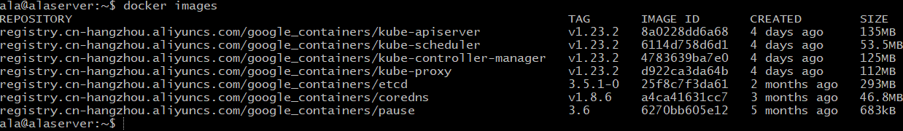

## 一、环境配置

虚拟机情况：

> 2核4G
>
> 30G磁盘
>
> Ubuntu20.04

Server3台：

> ala 作为Master节点
>
> ala1 两台作为Node节点


### 1.安装网络插件

```bash
sudo apt-get install net-tools
```

查看ip地址：

```bash
ifconfig -a
ssh server_name @ip
```

 

### 2.修改时区

```bash
cp /usr/share/zoneinfo/Asia/Shanghai /etc/localtime
```

 

### 3.安装docker

```bash
sudo apt-get install docker.io -y
```

添加sudo权限到docker：

```bash
sudo usermod -aG docker $USER
```

 

### 4.添加阿里源安装kubeadm

```bash
sudo vim /etc/apt/sources.list 
```

进去后添加下面的阿里源：

> deb https://mirrors.aliyun.com/kubernetes/apt kubernetes-xenial main

保存退出再添加key：

```bash
curl https://mirrors.aliyun.com/kubernetes/apt/doc/apt-key.gpg | sudo apt-key add
```

先update再安装kubeadm：

```bash
sudo apt-get update
sudo apt-get install kubeadm -y
# 指定版本则可，注意最后的-00
sudo apt-get install kubeadm=1.18.8-00 
```

 

### 5.初始化kubeadm init

关闭swap：`swapoff -a`

1.直接国内镜像，直接初始化：

```bash
kubeadm init --image-repository registry.aliyuncs.com/google_containers --ignore-preflight-errors=Swap
```

2.手动查看版本pull镜像并初始化

查看所需镜像和版本：`kubeadm config images list`

> k8s.gcr.io/kube-apiserver:v1.23.2
> k8s.gcr.io/kube-controller-manager:v1.23.2
> k8s.gcr.io/kube-scheduler:v1.23.2
> k8s.gcr.io/kube-proxy:v1.23.2
> k8s.gcr.io/pause:3.6
> k8s.gcr.io/etcd:3.5.1-0
> k8s.gcr.io/coredns/coredns:v1.8.6

```bash
docker pull registry.cn-hangzhou.aliyuncs.com/google_containers/kube-apiserver:v1.23.2
docker pull registry.cn-hangzhou.aliyuncs.com/google_containers/kube-controller-manager:v1.23.2
docker pull registry.cn-hangzhou.aliyuncs.com/google_containers/kube-scheduler:v1.23.2
docker pull registry.cn-hangzhou.aliyuncs.com/google_containers/kube-proxy:v1.23.2
docker pull registry.cn-hangzhou.aliyuncs.com/google_containers/pause:3.6
docker pull registry.cn-hangzhou.aliyuncs.com/google_containers/etcd:3.5.1-0
docker pull registry.cn-hangzhou.aliyuncs.com/google_containers/coredns:v1.8.6
```

下载完成后查看镜像并重新打tag：

`docker images`:



批量pull和tag和删除脚本：

```bash
#!/bin/bash
k8s_version=v1.23.2
pause_version=3.6
etcd_version=3.5.1-0
coredns_version=v1.8.6
# 拉取
docker pull registry.cn-hangzhou.aliyuncs.com/google_containers/kube-apiserver:$k8s_version
docker pull registry.cn-hangzhou.aliyuncs.com/google_containers/kube-controller-manager:$k8s_version
docker pull registry.cn-hangzhou.aliyuncs.com/google_containers/kube-scheduler:$k8s_version
docker pull registry.cn-hangzhou.aliyuncs.com/google_containers/kube-proxy:$k8s_version
docker pull registry.cn-hangzhou.aliyuncs.com/google_containers/pause:$pause_version
docker pull registry.cn-hangzhou.aliyuncs.com/google_containers/etcd:$etcd_version
docker pull registry.cn-hangzhou.aliyuncs.com/google_containers/coredns:$coredns_version
# tag
docker tag registry.cn-hangzhou.aliyuncs.com/google_containers/kube-apiserver:$k8s_version k8s.gcr.io/kube-apiserver:$k8s_version
docker tag registry.cn-hangzhou.aliyuncs.com/google_containers/kube-controller-manager:$k8s_version k8s.gcr.io/kube-controller-manager:$k8s_version
docker tag registry.cn-hangzhou.aliyuncs.com/google_containers/kube-scheduler:$k8s_version k8s.gcr.io/kube-scheduler:$k8s_version
docker tag registry.cn-hangzhou.aliyuncs.com/google_containers/kube-proxy:$k8s_version k8s.gcr.io/kube-proxy:$k8s_version
docker tag registry.cn-hangzhou.aliyuncs.com/google_containers/pause:$pause_version k8s.gcr.io/pause:$pause_version
docker tag registry.cn-hangzhou.aliyuncs.com/google_containers/etcd:$etcd_version k8s.gcr.io/etcd:$etcd_version
docker tag registry.cn-hangzhou.aliyuncs.com/google_containers/coredns:$coredns_version k8s.gcr.io/coredns/coredns:$coredns_version
# 删除原始镜像
docker rmi registry.cn-hangzhou.aliyuncs.com/google_containers/kube-apiserver:$k8s_version
docker rmi registry.cn-hangzhou.aliyuncs.com/google_containers/kube-controller-manager:$k8s_version
docker rmi registry.cn-hangzhou.aliyuncs.com/google_containers/kube-scheduler:$k8s_version
docker rmi registry.cn-hangzhou.aliyuncs.com/google_containers/kube-proxy:$k8s_version
docker rmi registry.cn-hangzhou.aliyuncs.com/google_containers/pause:$pause_version
docker rmi registry.cn-hangzhou.aliyuncs.com/google_containers/etcd:$etcd_version
docker rmi registry.cn-hangzhou.aliyuncs.com/google_containers/coredns:$coredns_version
```

初始化：

```bash
kubeadm init --kubernetes-version=v1.23.2
```

**报错：**

> [kubelet-check] It seems like the kubelet isn’t running or healthy.
> [kubelet-check] The HTTP call equal to ‘curl -sSL http://localhost:10248/healthz’ failed with error: Get http://localhost:10248/healthz: dial tcp 127.0.0.1:10248: connect: connection refused.

这是cgroup驱动问题。默认情况下Kubernetes cgroup驱动程序设置为system，但docker设置为systemd。需要更改Docker cgroup驱动：

```bash
sudo vim /etc/docker/daemon.json
```

写入：`{"exec-opts": ["native.cgroupdriver=systemd"]}`

为使配置生效，需要重启docker和kubelet

```bash
systemctl daemon-reload
systemctl restart docker
systemctl restart kubelet
```

完成后重新初始化：

```bash
sudo kubeadm reset
sudo kubeadm init
```

 

## 二、Kubernetes集群搭建：

### 1.部署Master节点：

YAML配置文件编写：

```yaml
apiVersion: kubeadm.k8s.io/v1beta2
kind: InitConfiguration
nodeRegistration:
	kubeletExtraArgs:
		cgroup-driver: "systemd"
---
apiVersion: kubeadm.k8s.io/v1beta2
kind: Clusterconfiguration
kubernetesVersion: "v1.23.2"
clusterName: "example-cluster"
controllerManagerExtraArgs:
	horizontal-pod-autoscaler-sync-period: "10s"
	node-monitor-grace-period: "10s"
apiServerExtraArgs:
	runtime-config: "api/all=true"
```

初始化成功：

```bash
kubeadm join 10.0.2.15:6443 --token 5477cz.qucvih5116a04cg0 \
        --discovery-token-ca-cert-hash sha256:c487b3213e434316f73fbd86d488d6109cd8f6bac810eeb6f7f67c84e9624a63
```


```bash
mkdir -p $HOME/.kube
sudo cp /etc/kubernetes/admin.conf ~/.kube/config && sudo chown $(id -u):$(id -g) $HOME/.kube/config

kubectl proxy --address='0.0.0.0'  --accept-hosts='^*$' &
```


 