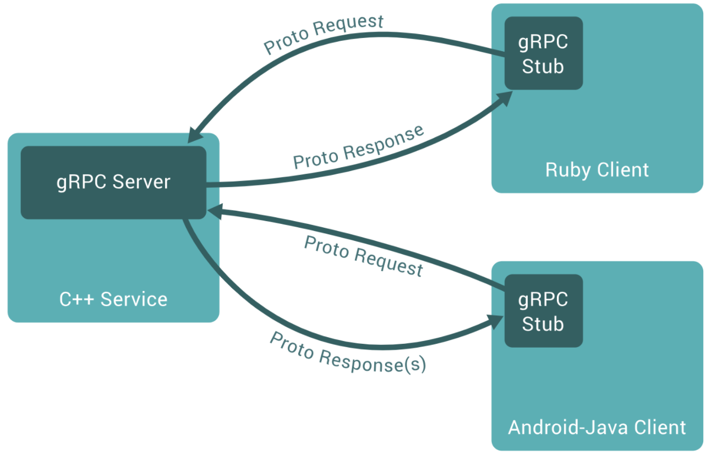

# 云计算

## 一、名词解释

#### Paas

> PaaS是（Platform as a Service）的缩写，是指[平台即服务](https://baike.baidu.com/item/平台即服务/4329761)。 把[服务器](https://baike.baidu.com/item/服务器/100571)平台作为一种服务提供的商业模式，通过网络进行程序提供的服务称之为SaaS(Software as a Service)，是云计算三种服务模式之一，而云计算时代相应的服务器平台或者开发环境作为服务进行提供就成为了PaaS(Platform as a Service)。
>
> 所谓PaaS实际上是指将[软件](https://baike.baidu.com/item/软件)研发的平台作为一种服务，以[SaaS](https://baike.baidu.com/item/SaaS)的模式提交给用户。因此，PaaS也是[SaaS](https://baike.baidu.com/item/SaaS)模式的一种应用。但是，PaaS的出现可以加快SaaS的发展，尤其是加快SaaS应用的开发速度。在2007年国内外SaaS厂商先后推出自己的[PAAS平台](https://baike.baidu.com/item/PAAS平台/123870)。

#### 容器编排

#### KVM

> Kernel-based Virtual Machine的简称，是一个开源的[系统虚拟化](https://baike.baidu.com/item/系统虚拟化)模块，自Linux 2.6.20之后集成在Linux的各个主要发行版本中。它使用[Linux](https://baike.baidu.com/item/Linux/27050)自身的调度器进行管理，所以相对于[Xen](https://baike.baidu.com/item/Xen)，其核心源码很少。KVM已成为学术界的主流[VMM](https://baike.baidu.com/item/VMM)之一。
>
> KVM的虚拟化需要硬件支持（如[Intel VT](https://baike.baidu.com/item/Intel VT)技术或者AMD V技术)。是基于硬件的完全虚拟化。而Xen早期则是基于软件模拟的Para-Virtualization，新版本则是基于硬件支持的完全虚拟化。但Xen本身有自己的[进程调度](https://baike.baidu.com/item/进程调度)器，[存储管理](https://baike.baidu.com/item/存储管理/9827115)模块等，所以代码较为庞大。广为流传的商业系统虚拟化软件[VMware ESX](https://baike.baidu.com/item/VMware ESX/795548)系列是基于软件模拟的Full-Virtualization。

#### Seccomp

> seccomp（全称securecomputing mode）是linuxkernel从2.6.23版本开始所支持的一种安全机制。
>
> 在Linux系统里，大量的系统调用（systemcall）直接暴露给用户态程序。但是，并不是所有的系统调用都被需要，而且不安全的代码滥用系统调用会对系统造成安全威胁。通过seccomp，我们限制程序使用某些系统调用，这样可以减少系统的暴露面，同时是程序进入一种“安全”的状态。

#### [Linux Cgroups](https://blog.csdn.net/ahilll/article/details/81940608)

> cgroups(Control Groups) 是 linux 内核提供的一种机制，**这种机制可以根据需求把一系列系统任务及其子任务整合(或分隔)到按资源划分等级的不同组内，从而为系统资源管理提供一个统一的框架**。简单说，cgroups 可以限制、记录任务组所使用的物理资源。本质上来说，cgroups 是内核附加在程序上的一系列钩子(hook)，通过程序运行时对资源的调度触发相应的钩子以达到资源追踪和限制的目的。
>
> cgroups 提供了四大功能：
>
> - 资源限制：cgroups 可以对任务是要的资源总额进行限制。比如设定任务运行时使用的内存上限，一旦超出就发 OOM。
> - 优先级分配：通过分配的 CPU 时间片数量和磁盘 IO 带宽，实际上就等同于控制了任务运行的优先级。
> - 资源统计：cgoups 可以统计系统的资源使用量，比如 CPU 使用时长、内存用量等。这个功能非常适合当前云端产品按使用量计费的方式。
> - 任务控制：cgroups 可以对任务执行挂起、恢复等操作。

#### etcd

> etcd是CoreOS团队于2013年6月发起的开源项目，它的目标是构建一个高可用的分布式键值(key-value)数据库。etcd内部采用`raft`协议作为一致性算法，etcd基于Go语言实现。
>
> etcd作为服务发现系统，有以下的特点：
>
> - 简单：安装配置简单，而且提供了HTTP API进行交互，使用也很简单
> - 安全：支持SSL证书验证
> - 快速：根据官方提供的benchmark数据，单实例支持每秒2k+读操作
> - 可靠：采用raft算法，实现分布式系统数据的可用性和一致性
>
> etcd项目地址：https://github.com/coreos/etcd/

#### gRPC

> A high-performance, open-source universal RPC framework
>
> 一个高性能、开源的通用RPC框架

RPC框架：

所谓RPC(remote procedure call 远程过程调用)框架实际是提供了一套机制，使得应用程序之间可以进行通信，而且也遵从server/client模型。使用的时候客户端调用server端提供的接口就像是调用本地的函数一样。

#### 负载均衡

> 负载均衡建立在现有网络结构之上，它提供了一种廉价有效透明的方法扩展[网络设备](https://baike.baidu.com/item/网络设备/7667828)和[服务器](https://baike.baidu.com/item/服务器/100571)的带宽、增加[吞吐量](https://baike.baidu.com/item/吞吐量/157092)、加强网络数据处理能力、提高网络的灵活性和可用性。
>
> 负载均衡*（Load Balance）*其意思就是分摊到多个操作单元上进行执行，例如Web[服务器](https://baike.baidu.com/item/服务器/100571)、[FTP服务器](https://baike.baidu.com/item/FTP服务器)、[企业](https://baike.baidu.com/item/企业/707680)关键应用服务器和其它关键任务服务器等，从而共同完成工作任务。

## 二、Linux 常用指令解释

#### AUFS

早期*docker*的默认文件系统是AUFS（后来是Overlay）

AUFS 的全称是 Advanced Union filesytem，它的主要功能是：把多个目录结合成一个目录，对外使用。把多个目录 mount 成一个，读写操作步骤如下：

> 1. 默认情况下，最上层的目录为读写层，只能有一个
> 2. 下面可以有一个或者多个只读层读文件
> 3. 读文件，从最上面一个开始往下逐层去找，打开第一个找到的文件，读取其中的内容
> 4. 写文件，如果在最上层找到了该文件，直接打开
>    否则，从上往下开始查找，找到文件后，把文件复制到最上层，然后再打开这个 copy
> 5. 删除文件：在最上层创建一个 whiteout 文件，.wh.<origin_file_name>，就是在原来的文件名字前面加上 .wh.

假设有如下文件结构

> \# tree
>
> .
> ├── A
> │   ├── a.txt
> │   └── x.txt
> ├── mnt
> └── B
>     ├── b.txt
>     └── x.txt

> mount -t aufs -o br=./top/:./base none ./mnt

mount 命令的参数意义如下：

> -t aufs：mount 的文件类型，使用的是 aufs
> -o：传递个 aufs 的选项，每个文件类型的选项不同
> br：表示 branch，也就是 aufs 需要的的各个目录
> none：这个本来是设备的名字，但是我们并没有用到任何设备，只会用到文件夹，因此这里为 none
> ./mnt：挂载点，也就是内容最终出现的目录

挂载完成后mnt目录，x被合并了：

> \# ls mnt base.txt  common.txt  foo.txt
>
> a.txt    b.txt   x.txt

如果在mnt中修改文件，那么这些修改在原A，B目录也会生效。
