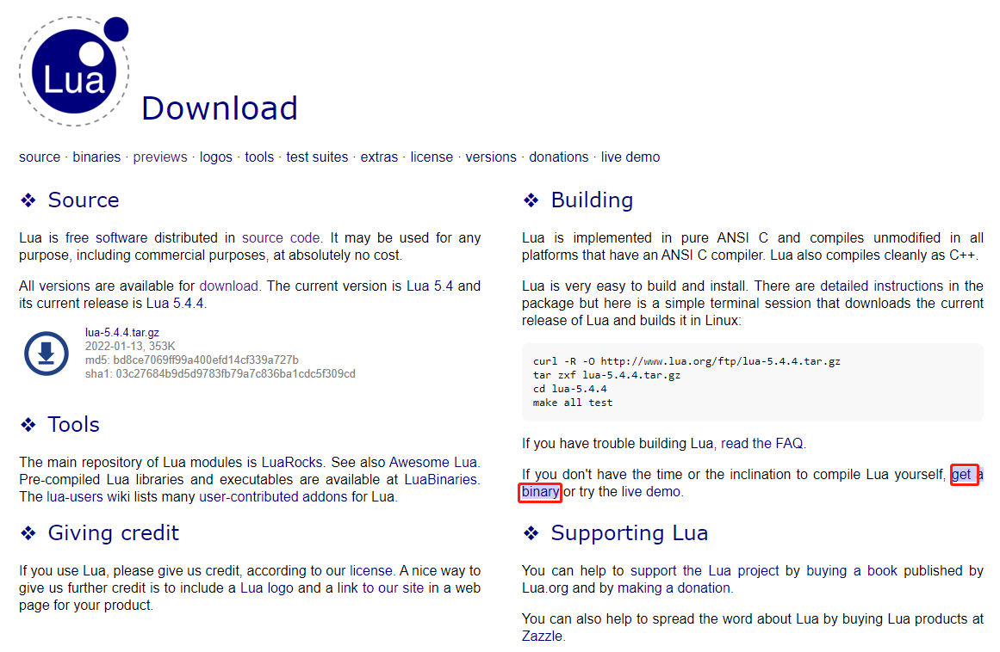
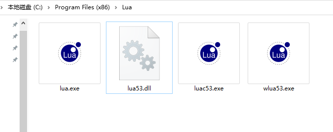
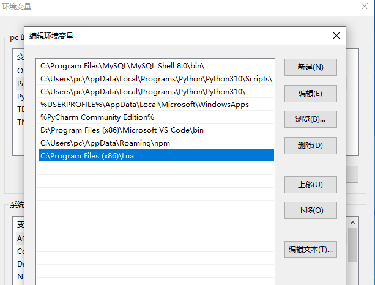

### 一、环境搭建

win10 下 get a binary



下载后解压，lua53.exe可以改下名字，去掉53，方便添加环境变量后命令行调用：




配置环境变量：




### 二、基础语法：

变量名：

数字、字母、下划线，非数字开头。not beginning with a digit.

```lua
--全局变量声明
> b --> nil
> b = 10
> b --> 10

> b = nil
> b --> nil

--数据类型
> type(nil) --> nil
> type(true) --> boolean
> type(10.4 * 3) --> number
> type("Hello world") --> string
> type(io.stdin) --> userdata
> type(print) --> function
> type(type) --> function
> type({}) --> table
> type(type(X)) --> string

```


关键字：

and    break	do	else 	elseif

end	false	for	function	goto

if 	in	local	nil	not	until	while

or	repeat	return	then	ture


注释：

```lua
--单行注释

--[[多行
注释]]
```


关系运算符：

<  >  <=  >=  ==  ~=


随机数生成：math.random()

``` lua
math.random()  -- return real number [0, 1)
math.random(n) -- return real number [1, n]
math.random(l, u) -- return real number [l, u]
```


