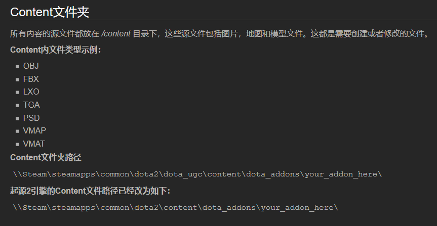

*** 参考资料：***

> moddota：https://moddota.com/
>
> Value官方创意工坊：https://developer.valvesoftware.com/wiki/Dota_2_Workshop_Tools:zh-cn
>
> RobinCode_Dota2API：https://robincode.cn/dota2/logs
>
> 阿哈利姆魔法隐修议会：http://www.dota2rpg.com/
>
> reddit：https://www.reddit.com/r/Dota2Modding/

## 一、地形编辑器与关卡设计

1.地图文件目录

.png)

.png)

.png)

2.按钮和操作

## 二、技能编写

## 三、UI编写

