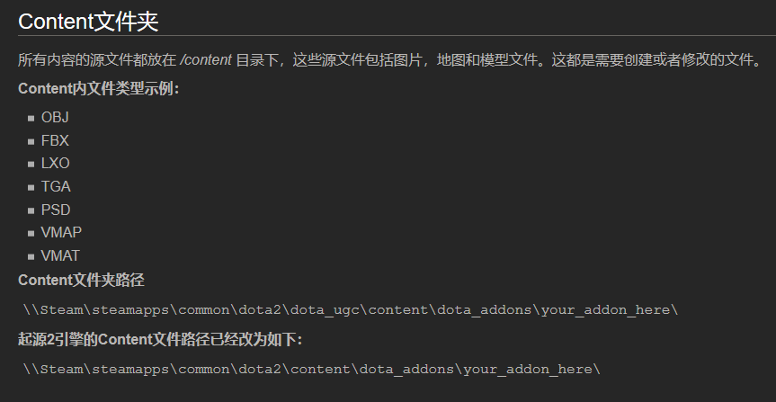
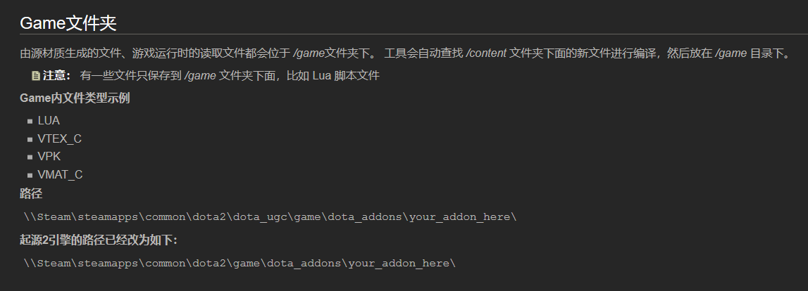

***参考资料:***

> moddota：https://moddota.com/
>
> Value官方创意工坊：https://developer.valvesoftware.com/wiki/Dota_2_Workshop_Tools:zh-cn
>
> RobinCode_Dota2API：https://robincode.cn/dota2/logs
>
> 阿哈利姆魔法隐修议会：http://www.dota2rpg.com/
>
> reddit：https://www.reddit.com/r/Dota2Modding/
>
> b站彩紫睨羽编辑器入门：https://www.bilibili.com/video/BV1s4411W7rw?spm_id_from=333.999.0.0
>
> Youtube入门教程：[https://www.bilibili.com/video/BV1s4411W7rw?spm_id_from=333.999.0.0](https://www.youtube.com/watch?v=kzj9yM_9zAw&list=PL7yysLaMSd3uY4iJKJdRrTkN1gYePkMz2)
> 

## 一、地形编辑器与关卡设计

1.地图文件目录

2.按钮和操作

## 二、技能编写

## 三、UI编写

