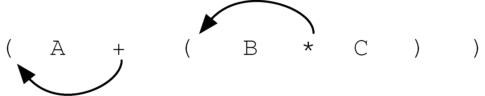
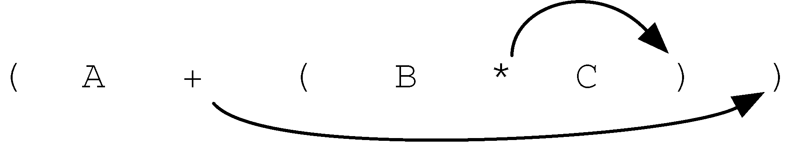
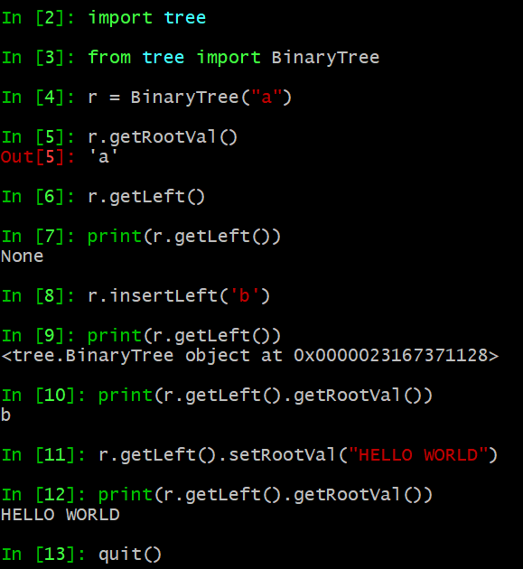

# 数据结构入门

## 一、栈

栈：LIFO，后进先出

- 栈方法：

Stack()：创建一个空的新栈。它不需要参数，并返回一个空栈。

push(item)：将一个新项添加到栈的顶部。它需要item做参数并不返回任何内容。

pop()：从栈中删除顶部项。它不需要参数并返回item。栈被修改。 

peek()：从栈返回顶部项，但不会删除它。不需要参数。不修改栈。

isEmpty()：测试栈是否为空。不需要参数，并返回布尔值。

size()：返回栈中的item数量。不需要参数，并返回一个整数。

- 栈的python代码实现：

```python
class Stack():
    def __init__(self):
        self.s = []  # 生成Stack栈对象的时候自动创建一个空栈

    def isEmpty(self):
        return self.s == []

    def push(self, x):
        self.s.append(x)

    def pop(self):
        self.s.pop()

    def peek(self):
        return self.s[-1]

    def size(self):
        return len(self.s)
```

- 使用栈进行括号匹配：

思路：遇到左括号入栈，遇到右括号且栈不为空出栈，栈为空则说明不匹配，否则比较栈顶元素和当前出栈元素是否匹配。

```python
	s = Stack()
	cc = "[[{{(())}}]]"
	
	flag = True
	d = {
	    ")":"(",
	    "}":"{",
	    "]":"["
	}
	for c in cc:
	    if c in "([{":
	        s.push(c)
	    else:
	        if s.isEmpty(): 
	            flag = False
	        else:
	            if s.peek() != d[c]:
	                flag=False
	            s.pop()
	if flag and s.isEmpty():
	    print("匹配")
	else:
	    print("不匹配")

```

- 使用栈进制转换(10) n

```python
	def divieBy2(num, n):  # 10进制转n进制
	    digits = "0123456789ABCDEF"
	    s1 = Stack()
	    while num != 0:
	        y = num % n
	        s1.push(y)
	        num //= n
	    
	    string = ''
	    while not s1.isEmpty():
	        string += digits[s1.pop()]
	    
	    return string
	print(divieBy2(10, 16))

```

- 前中后缀表达式栈的使用

中缀：A+B*C-D

前缀：-+A*BCD 

后缀：ABC*+D-

转换方式：1.改写中缀为完全括号表达式，((A+(B*C))-D)

​				   2.前缀则将运算符前移并消去括号，后缀则后移





前缀后缀表达式计算方法：遇数入栈，遇运算符出栈两操作数运算，运算结果入栈。

```python
	# 计算前缀表达式
	prefix = '7 8 + 3 2 + /'
	def prefix_eval(prefix):
	    s = Stack()
	    p_list = prefix.split(' ')
	    for i in p_list:
	        if i.isdigit():
	            s.push(int(i))  # 操作数入栈
	        else:
	            op1 = s.pop()    # 栈顶操作数1
	            op2 = s.pop()    # 栈顶操作数2
	            result = domath(op1,op2,i) # 和当前运算符运算
	            s.push(result)   # 重新压入运算结果
	    return s.pop()
	def domath(x, y, op):
	    if op == "*":
	        return x * y
	    elif op == '/':
	        return y / x
	    elif op == '+':
	        return x + y
	    else:
	        return x - y
	print(prefix_eval(prefix))

```


## 二、队列


## 三、链表


## 四、递归


## 五、搜索


## 六、树

树的定义：

1.常规定义

- 有一个根节点；
- 除根节点外，其他每个节点都与其唯一的父节点相连；
- 从根节点到其他每个节点都有且仅有一条路径；
- 如果每个节点最多有两个子节点，我们就称这样的树为**二叉树** 。

2.递归定义

- 一棵树要么为空，要么由一个根节点和零棵或多棵子树构成，子树本身也是一棵树。每棵子树的根节点通过一条边连到父树的根节点。

3.完全二叉树：

- 除了最底层，其他每一层的节点都是满的，最底层节点从左往右填充


*递归定义的一棵树 ：*

```python
class BinaryTree:
    def __init__(self, root):
        self.val = root
        self.left = None
        self.right = None

    def insertLeft(self, node):
        if self.left == None:  # 如果为空，直接插入
            self.left = BinaryTree(node)
        else:                  # 已经存在左子节点，插入一个节点需要将当前节点降一层 
            t = BinaryTree(node)
            t.left = self.left
            self.left = t

    def insertRight(self, node):
        if self.right == None:
            self.right = BinaryTree(node)
        else:
            t = BinaryTree(node)
            t.right = self.right
            self.right = t

    def getRight(self):
        return self.right

    def getLeft(self):
        return self.left

    def setRootVal(self, val):
        self.val = val

    def getRootVal(self):
        return self.val

```




二叉堆——最小堆


## 七、图

