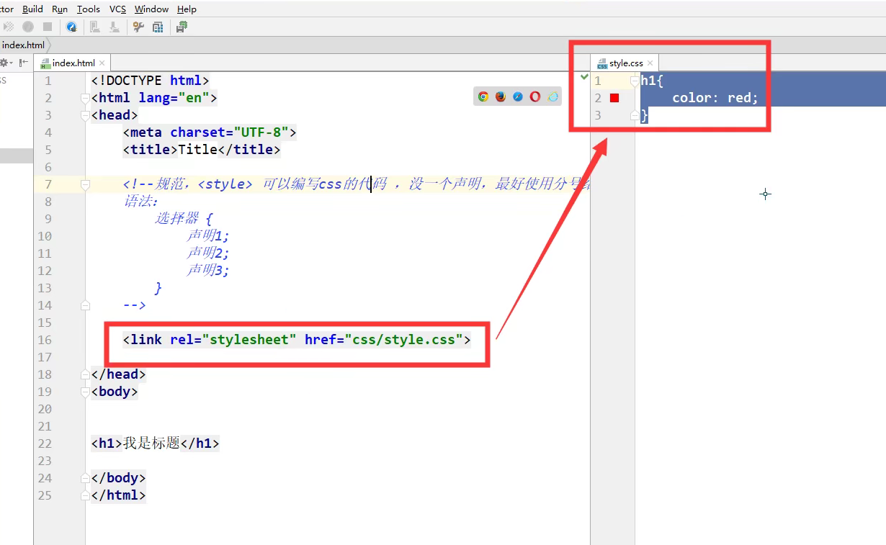

# [CSS入门教程](https://www.bilibili.com/video/BV1YJ411a7dy)

## 一、什么是CSS

### 1.1 什么是CSS

>层叠样式表(英文全称：Cascading Style Sheets)是一种用来表现[HTML](https://baike.baidu.com/item/HTML)（[标准通用标记语言](https://baike.baidu.com/item/标准通用标记语言/6805073)的一个应用）或[XML](https://baike.baidu.com/item/XML)（标准通用标记语言的一个子集）等文件样式的计算机语言。CSS不仅可以静态地修饰网页，还可以配合各种脚本语言动态地对网页各元素进行格式化。
>
>CSS 能够对网页中元素位置的排版进行像素级精确控制，支持几乎所有的字体字号样式，拥有对网页对象和模型样式编辑的能力。

### 1.2 发展史

CSS1.0

CSS2.0 DIV(块) + CSS，HTML与CSS结构分离的思想，网页变得简单，SEO（Search Engine Optimization）

CSS2.1 浮动，定位

CSS3.0 圆角，阴影，动画......浏览器兼容性

### 1.3 快速入门

<style> </style>


**基本入门**

```html5
<!DOCTYPE html>
<html lang="en">
<head>
    <meta charset="UTF-8">
    <title>Title</title>
    <!--  规范，<style> 可以编写css的代码
    语法:
        选择器{
            声明1;
            声明2;
            声明3;
            声明4;
        }
    -->
    <style>
        h1{
            color: red;
        }
    </style>

</head>
<body>
<h1>我是标题</h1>

</body>
</html>
```

建议使用这种引用方式：


<div>
    
</div>




**css的优势：**

1.内容表现分离

2.网页就够表现统一可以实现复用

3.样式十分丰富

4.建议使用独立于html的css文件

5.利用SEO，容易被搜索引擎搜录


### 1.3 CSS的三种导入方式

- 行内样式

  ```html
  <!--内部样式-->
  <h1 style="color: red; fontsize: 15px;">
      我式标题
  </h1>
  ```

- 链接式

  ```html
  <!--外部样式-->
  <link rel="stylesheet" href="css/style.css">
  ```

- 导入式

  @import 是css2.1特有的

  ```html
  <!--导入式-->
  <style>@import url("css/style.css")</style>
  ```


## 二、CSS选择器

### 2.1 基本选择器

优先级：id > class > 标签

1. 标签选择器：选择一类标签 `标签名{}`
2. 类选择器 class：选择所有class属性一致的标签 ，跨标签`.class名{}`
3. id选择器：全局唯一`#id名{}`

### 2.2层次选择器

后代选择器：某个元素后面的所有元素如：body 下的所有p标签（包含内部所有子标签）

```css
/*后代选择器*/
body p{
    background: red;
}
```

子选择器：当前标签的下一代，儿子标签

```css
/*子选择器*/
body>p{
    background: red;
}
```

相邻兄弟选择器：同辈的相邻下一个，只选择一个，不包括子标签

```css
/*相邻兄弟选择器，只选择一个下面相邻的标签*/
.p2class + p{
            background: yellow;
        }
```

通用兄弟选择器：同辈所有标签，不包括子标签

```css
/*当前元素的相邻向下所有兄弟元素*/
.p2class ~ p{
            background: yellow;
        }
```


### 2.3结构伪类选择器

``` css
/*ul的第一个子元素*/
ul li:first-child{
            background: yellow;
        }
/*ul的第二个子元素*/
ul li:first-child + li{
            background: yellow;
        }
/*ul的最后一个子元素*/
ul li:last-child{
            background: yellow;
        }
/*选中当前p元素的父级元素，选中父级元素的第一个，并且是当前元素才生效*/
p:nth-child(1){
            background: yellow;
        }

/*选中当前元素父元素下的p元素的第2个，按类型选则*/
p:nth-of-type(2)){
            background: yellow;
        }
```

### 2.4属性选择器（建议使用）

id + class 结合，功能更加强大，支持正则匹配

`label[classname = value(support reGex)]`

```css
/*选中存在id属性的元素*/
a[id]{
    background: red;
    font-size: 20px;
}
/*选中class包含link的元素*/
a[class*="link"]{
    background: red;
    font-size: 20px;
}
/*选中href中以http开头的元素*/
a[href^="http"]{
    background: red;
    font-size: 20px;
}
/*选中href中以com结尾的元素*/
a[href$="http"]{
    background: red;
    font-size: 20px;
}
```


