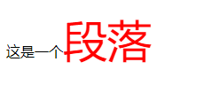
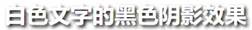

# [CSS入门教程](https://www.bilibili.com/video/BV1YJ411a7dy)

## 一、什么是CSS

### 1.1 什么是CSS

>层叠样式表(英文全称：Cascading Style Sheets)是一种用来表现[HTML](https://baike.baidu.com/item/HTML)（[标准通用标记语言](https://baike.baidu.com/item/标准通用标记语言/6805073)的一个应用）或[XML](https://baike.baidu.com/item/XML)（标准通用标记语言的一个子集）等文件样式的计算机语言。CSS不仅可以静态地修饰网页，还可以配合各种脚本语言动态地对网页各元素进行格式化。
>
>CSS 能够对网页中元素位置的排版进行像素级精确控制，支持几乎所有的字体字号样式，拥有对网页对象和模型样式编辑的能力。

### 1.2 发展史

CSS1.0

CSS2.0 DIV(块) + CSS，HTML与CSS结构分离的思想，网页变得简单，SEO（Search Engine Optimization）

CSS2.1 浮动，定位

CSS3.0 圆角，阴影，动画......浏览器兼容性

### 1.3 快速入门

<style> css代码 </style>

**基本入门**

```html5
<!DOCTYPE html>
<html lang="en">
<head>
    <meta charset="UTF-8">
    <title>Title</title>
    <!--  规范，<style> 可以编写css的代码
    语法:
        选择器{
            声明1;
            声明2;
            声明3;
            声明4;
        }
    -->
    <style>
        h1{
            color: red;
        }
    </style>

</head>
<body>
<h1>我是标题</h1>

</body>
</html>
```

行内样式：

```html
<h1 style="red">标题1</h1>
```

引用样式：

``` html
<link rel="stylesheet" href="css/style.css">
```

```css
/*位置：css/style.css */
h1{
    color: red;
    background: green;
    font-size: 50px;
}
```


**css的优势：**

1.内容表现分离

2.网页就够表现统一可以实现复用

3.样式十分丰富

4.建议使用独立于html的css文件

5.利用SEO，容易被搜索引擎搜录


### 1.3 CSS的三种导入方式

- 行内样式

  ```html
  <!--内部样式-->
  <h1 style="color: red; fontsize: 15px;">
      我式标题
  </h1>
  ```

- 链接式

  ```html
  <!--外部样式-->
  <link rel="stylesheet" href="css/style.css">
  ```

- 导入式

  @import 是css2.1特有的

  ```html
  <!--导入式-->
  <style>@import url("css/style.css")</style>
  ```


## 二、CSS选择器

### 2.1 基本选择器

优先级：id > class > 标签

1. 标签选择器：选择一类标签 `标签名{}`
2. 类选择器 class：选择所有class属性一致的标签 ，跨标签`.class名{}`
3. id选择器：全局唯一`#id名{}`

### 2.2层次选择器

后代选择器：某个元素后面的所有元素如：body 下的所有p标签（包含内部所有子标签）

```css
/*后代选择器*/
body p{
    background: red;
}
```

子选择器：当前标签的下一代，儿子标签

```css
/*子选择器*/
body>p{
    background: red;
}
```

相邻兄弟选择器：同辈的相邻下一个，只选择一个，不包括子标签

```css
/*相邻兄弟选择器，只选择一个下面相邻的标签*/
.p2class + p{
            background: yellow;
        }
```

通用兄弟选择器：同辈所有标签，不包括子标签

```css
/*当前元素的相邻向下所有兄弟元素*/
.p2class ~ p{
            background: yellow;
        }
```


### 2.3结构伪类选择器

``` css
/*ul的第一个子元素*/
ul li:first-child{
            background: yellow;
        }
/*ul的第二个子元素*/
ul li:first-child + li{
            background: yellow;
        }
/*ul的最后一个子元素*/
ul li:last-child{
            background: yellow;
        }
/*选中当前p元素的父级元素，选中父级元素的第一个，并且是当前元素才生效*/
p:nth-child(1){
            background: yellow;
        }

/*选中当前元素父元素下的p元素的第2个，按类型选则*/
p:nth-of-type(2)){
            background: yellow;
        }
```

### 2.4属性选择器（建议使用）

id + class 结合，功能更加强大，支持正则匹配

`label[classname = value(support reGex)]`

```css
/*选中存在id属性的元素*/
a[id]{
    background: red;
    font-size: 20px;
}
/*选中class包含link的元素*/
a[class*="link"]{
    background: red;
    font-size: 20px;
}
/*选中href中以http开头的元素*/
a[href^="http"]{
    background: red;
    font-size: 20px;
}
/*选中href中以com结尾的元素*/
a[href$="http"]{
    background: red;
    font-size: 20px;
}
```


## 三、美化网页元素

### 3.1 为什么要美化

1. 有效传递页面信息
2. 提高用户体验


span标签：重点要突出的字，使用span标签套起来

```html
<style>
    #important-paragraph{
        font-size: 50px;
        color: red;
    }
</style>

<p>这是一个<span id="important-paragraph">段落</span></p>
```




### [3.2 字体和样式](https://www.w3school.com.cn/css/css_font.asp)

```html
<!--
font-family：字体
font-size：字体大小
font-weight：字体粗细
color：字体颜色
	单词：red,green,blue...
	16进制：#FF0000,#00FF00,#0000FFF
	RGBA:rgba(255,0,0,100)

text-align：排版
	left：靠左，right：靠右，center：居中

text-indent：首行缩进
	2em：缩进2个字母
	2px：缩进两个像素

height：块高度
line-height：行高
	如果块高和行高一样，文字则可居中对齐

text-decoration:underline     下划线
			   :line-through  删除线
			   :overline      上划线
-->
<style>
    body{
        font-family: "Arial Black", 楷体;
        color: darkred;
    }
    h1{
        font-size: 50px;
    }
</style>

```


### [3.3伪类](https://www.w3school.com.cn/css/css_pseudo_classes.asp)

伪类用于定义元素的特殊状态。

例如，它可以用于：

- 设置鼠标悬停在元素上时的样式
- 为已访问和未访问链接设置不同的样式
- 设置元素获得焦点时的样式

```css
/*语法*/
selector:pseudo-class {
  property: value;
}
/*示例*/
a:link {color:#FF0000;} /* 未访问的链接 */
a:visited {color:#00FF00;} /* 已访问的链接 */
a:hover {color:#FF00FF;} /* 鼠标悬停时触发 */
a:active {color:#0000FF;} /* 已选中的链接 */
```


### [3.4渐变](https://www.w3school.com.cn/css/css3_gradients.asp)

CSS 定义了两种渐变类型：

- *线性渐变*（向下/向上/向左/向右/对角线）

  ```css
  background-image: linear-gradient(direction, color-stop1, color-stop2, ...);
  ```

- *径向渐变*（由其中心定义）

  ```css
  background-image: radial-gradient(shape size at position, start-color, ..., last-color);
  ```

### 3.5 阴影效果



```html
<style>
h1 {
  color: white;
  text-shadow: 3px 3px 5px #000000;  <!--水平偏移 垂直偏移 模糊度 颜色-->
}
<!--h2的内容上添加了包围文字的黄色边框-->    
h2 {
  color: yellow;
  text-shadow: -1px 0 black, 0 1px black, 1px 0 black, 0 -1px black;
}
</style>
```

