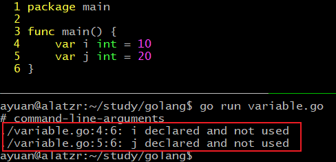
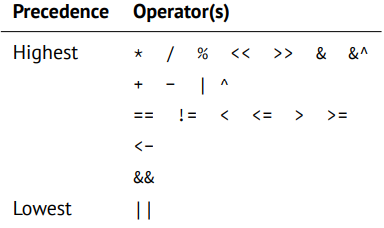
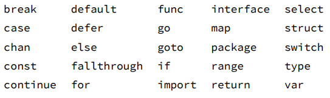

# Golang 学习笔记

## 一、hello world

```go
package main
import "fmt"  // 写作 ."fmt" 则可直接调用库数，如Println

func mian(){
    fmt.Println("HELLO WORLD")  
}
```

编译：`go build helloworld.go`

直接运行：`go run helloworld.go`


## 二、变量

### 2.1变量声明：

```go
var a int  // 声明int类型变量a，默认赋值为null
var s string  // 声明string类型变量s，默认值为""
var b bool  // 声明布尔类型变量b，默认值为false

/*多个声明为组*/
var (
	x int = 10
    y bool
    z string
)
/* 多变量声明和赋值 */
var a, b, c, d = v1, v2, v3, v4 // v1~v4可以为不同类型


/* 简短声明赋值方法 */
var sex = "male"  // 变量有初值，go可以自动推断类型
name := "gdy"   // 此种方式不能作为全局变量的声明，只能用在函数体内
age := 25


/*字符串和字符*/
var str string = "这是一个字符串"  // 字符串不可变，同python
var multi_str string =`first line  // 多行字符串使用反撇号``包裹
second line
third line
`
var chr rune = 'a'  // rune是int32的别名，utf-8编码，a的值为对应的ASCII码，97
```

**注意事项：**

1. 变量必须先定义后使用
2. 变量类型和赋值类型必须一致
3. 变量名不能冲突（同一个作用域内）
4. 简短定义方式不能定义全局变量，且定义的变量必须是新变量
5. 变量定义后必须使用

变量在声明后未使用会报错：

<br/>

### 2.2常量

常量的声明使用const关键字，常量只能是数字，字符串或者布尔值。

`const <name> type = value`

```go
const a string = "abc"  // 显式定义
const b = 10  // 隐式定义
```

枚举类型常量：

```go
// iota可以生成枚举值
const (
	a = 10
    b 		  // b = 10
    c = iota  // c = 2
    d		  // d = 3
    e = 10 
    f         // f = 10
    g = iota  // g = 6  
)
```

>单词 [iota] 在日常英语短语 “not one iota”，意思是 “不是最小”，是来自新约中的短语：“until heaven and earth pass away, not an iota, not a dot, will pass from the Law.”


### 2.3运算符、关键字

运算符：

<br/>


关键字：

<br/>


## 三、数据类型

### 3.1基本数据类型

- bool 布尔类型
- Numeric Types 整型
  - int8，int16，int32，int64
  - uint8，uint16，uint32，uint64
  - float32，float64
  - complex64，complex128
  - byte
  - rune
- string 字符型


### 3.2数据类型转换

语法格式：`Type(value)`

```go
/*兼容类型可以转换，如int和float之间。不兼容类型要使用其他方法，如int和string*/
var a int = 10
var b float32
b = float32(a)  // 不支持隐式转换，写作b = a会报错
```


## 四、流程控制语句

### 4.1条件语句if

语法格式：

```go
if 布尔表达式{
    /*布尔表达式为true时执行*/
}
```

```go
if 布尔表达式 {
   /* 在布尔表达式为 true 时执行 */
} else {
  /* 在布尔表达式为 false 时执行 */
}
```

```go
if 布尔表达式1 {
   /* 在布尔表达式1为 true 时执行 */
} else if 布尔表达式2{
   /* 在布尔表达式1为 false ,布尔表达式2为true时执行 */
} else{
   /* 在上面两个布尔表达式都为false时，执行*/
}
```

输出a和b中较大的值：

```go
package main
import ."fmt"

func main(){
    var a int = 10
    b := 20
    if a > b{
        Println(a)
    } else{
        Println(n)
    }
}
```

变体：

```go
package main
import ."fmt"

func main(){
    if num := 20; num > 10 && num % 2 == 0{  // 此时num的作用域只在if内
        Println(num)
    }
}
```


### 4.2条件语句switch

语法格式：

```go
switch var1 {
    case val1:
        ...
    case val2:
        ...
    default:
        ...
}
```

```go
package main
import ."fmt"

func main(){
    var grade string
    var mark = 90
    // mark的值进行匹配
    switch mark{
        case 90: grade = "A"
        case 80: grade = "B"
        case 60,70: grade = "C"  // 可以多个值
        default: grade = "D"
    }
    // switch 后面没有表达式，则默认为true
    switch {
        case grade == "A": Println("优秀！") 
        // fallthrough 可以贯通下一个case
        case grade == "B": Println("良好！")
        case grade == "C": Println("及格！")
        case grade == "D", grade == "E": Println("不及格！")
    }
}
```

**switch的注意事项：**

1. case后的常量不能重复
2. case后可以有多个常量值
3. fallthrough可以贯通下一个case，fallthrough必须写在case语句的末尾最后一行，如果在中间则会报错


### 4.3 循环语句for

语法格式：

`for init; condition; increment{
    statement
}`

求1-100的整数和：

```go
package main
import ."fmt"

func main(){
    sum := 0
    for i := 1; i <= 100; i++ {
        sum += i
    }
    Println(sum)
}
```


